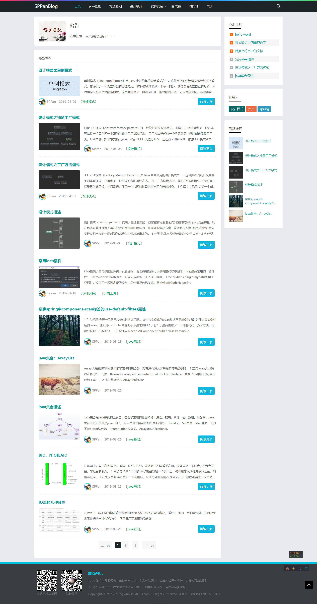
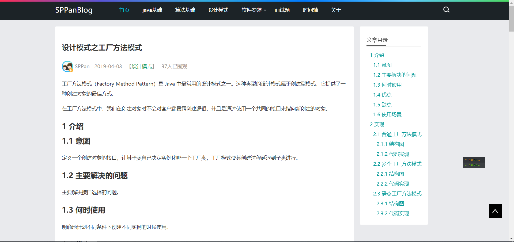
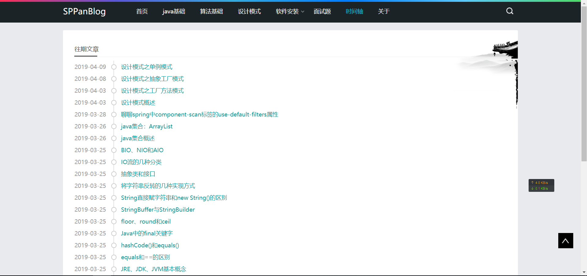
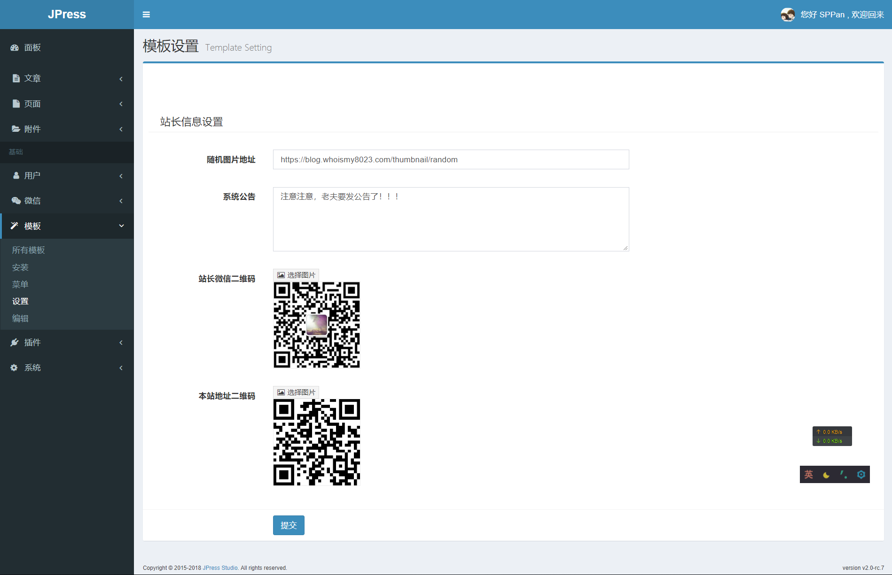

# JpressSPPanBlog

# 介绍

一款jpress的博客主题，支持功能：

1、自定义站点信息二维码。

2、系统公告。

3、文章默认缩略图或者随机缩略图展示。

设置非常简单，只需要填入一个随机图片的地址即可实现，例如：[https://blog.whoismy8023.com/thumbnail/random](https://blog.whoismy8023.com/thumbnail/random)。

当然，也可以作为默认图片设置，直接填入一个固定图片的地址即可。

4、支持文章目录显示（TOC）

## 预览

